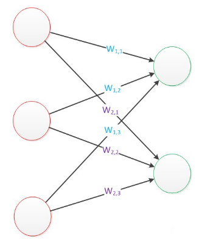

# 神经网络
## 题目描述
小明最近在学习机器学习中的神经网络。

1943年，心理学家McCulloch和数学家Pitts参考了生物神经元的结构，发表了抽象的神经元模型MP。

神经元模型是一个包含输入，输出与计算功能的模型。输入可以类比为神经元的树突，而输出可以类比为神经元的轴突，计算则可以类比为细胞核。

连接是神经元中最重要的东西。每一个连接上都有一个权重。

我们使用`x`来表示输入，用`W`来表示权值。一个表示连接的有向箭头可以这样理解：在初端，传递的信号大小仍然是`x`，端中间有加权参数`W`，经过这个加权后的信号会变成`W*x`，因此在连接的末端，信号的大小就变成了`W*x`。为了将信号映射到完备的空间，我们通常对于输出信号再加上一个偏置`b`。

于是在不考虑激活函数的情况下，我们得到了一层神经网络前向传播的公式：

$$y=Wx+b$$

其中 $x$ 是 $n$ 维列向量，$W$ 是$m \times n$的矩阵，$y$ 和 $b$ 都是 $m$ 维列向量。

当$n=3$，$m=2$时，神经网络结构如图所示

现在你的任务就是帮助小明，设计一个程序计算给定输入的神经网络输出



## 输入格式

对于每组输入，

第一行给出输入神经元个数`n`和输出神经元个数`m`；

第二行给出`n`个整数，表示输入向量 $x$

第三行开始的`m`行，每行给出`n`个整数，这些数构成了权值矩阵 $W$，而当前的整数则为`W`的分量 $W_{ij}$

第四行给出`m`个整数，表示偏置向量 $b$

## 输出格式

输出一行，为用空格分开的`m`个整数，表示神经网络的输出 $y$。注意没有行尾空格。

## 输入样例

```
3 2
1 2 3
0 1 2
4 3 0
4 5
```

## 输出样例

```
12 15
```