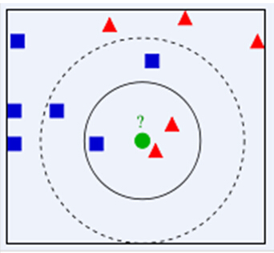

# 神经网络
## 题目描述
小明最近在学习机器学习中的神经网络。

1943年，心理学家McCulloch和数学家Pitts参考了生物神经元的结构，发表了抽象的神经元模型MP。

神经元模型是一个包含输入，输出与计算功能的模型。输入可以类比为神经元的树突，而输出可以类比为神经元的轴突，计算则可以类比为细胞核。

连接是神经元中最重要的东西。每一个连接上都有一个权重。

我们使用`x`来表示输入，用`W`来表示权值。一个表示连接的有向箭头可以这样理解：在初端，传递的信号大小仍然是`x`，端中间有加权参数`W`，经过这个加权后的信号会变成`W*x`，因此在连接的末端，信号的大小就变成了`W*x`。为了将信号映射到完备的空间，我们通常对于输出信号再加上一个偏置`b`。

于是在不考虑激活函数的情况下，我们得到了一层神经网络前向传播的公式：

$$y=Wx+b$$

其中 $x$ 是 $n$ 维列向量，$W$ 是$m \times n$的矩阵，$y$ 和 $b$ 都是 $m$ 维列向量。

当$n=3$，$m=2$时，神经网络结构如图所示

现在你的任务就是帮助小明，设计一个程序计算给定输入的神经网络输出。


## 输入格式

对于每组输入，

第一行给出输入神经元个数`n`和输出神经元个数`m`；

第二行给出`n`个整数，表示输入向量 $x$

第三行开始的`m`行，每行给出`n`个整数，这些数构成了权值矩阵 $W$，而当前的整数则为`W`的分量 $W_{ij}$

第四行给出`m`个整数，表示偏置向量 $b$

对于所有的数据，$0 \lt n \le 100$，$0 \lt m \le 100$，$0 \le W_{i,j},x_i,b_i \lt 10$，

## 输出格式

输出一行，为用空格分开的`m`个整数，表示神经网络的输出 $y$。注意没有行尾空格。

## 输入样例

```
3 2
1 2 3
0 1 2
4 3 0
4 5
```

## 输出样例

```
12 15
```

# K最近邻算法

## 题目描述

小明最近在学习机器学习中的K最近邻算法。K最近邻(kNN，k-NearestNeighbor)分类算法是数据挖掘分类技术中最简单的方法之一。所谓K最近邻，就是k个最近的邻居的意思，说的是每个样本都可以用它最接近的k个邻居来代表。

kNN算法的核心思想是如果一个样本在特征空间中的`k`个最相邻的样本中的大多数属于某一个类别，则该样本也属于这个类别，并具有这个类别上样本的特性。该方法在确定分类决策上只依据最邻近的一个或者几个样本的类别来决定待分样本所属的类别。 kNN方法在类别决策时，只与极少量的相邻样本有关。由于kNN方法主要靠周围有限的邻近的样本，而不是靠判别类域的方法来确定所属类别的，因此对于类域的交叉或重叠较多的待分样本集来说，kNN方法较其他方法更为适合。



不过简而言之，kNN的预测机制也很简单。如图所示，假设`k`=3，距离度量欧氏距离$d(x, y)=\sqrt{\sum_{k=1}^{n}\left(x_{k}-y_{k}\right)^{2}}$，我们只需要找出距离待遇测点最近的三个点，然后通过`多数表决`的方法决定待遇测点的类别。所谓多数表决，就是最近的`k`个点中类别出现最多的那个类别，就是表决结果的类表。如图中如果`k=3`，表决结果为红色类别；如果`k=5`，表决结果为蓝色类别。

现在，你的任务就是帮助小明设计一个简单的kNN算法，在记录了训练集的数据之后，对于输入的坐标给出相应的预测。

注意：本题中的距离度量为欧氏距离，并且样本点只有两个属性$(x,y)$。并且样本点的类别(label)用整数表示，$label=0\cdots{l}-1$。$l$为类别个数。

## 输入格式

第一行为三个整数`n` ，`l` ，`k`。`n`表示训练样本的个数；`l`表示训练样本点类别的个数（类别label的表示方法见上文）；`k`表示kNN模型中的k（具体含义见上文）。
第二行开始的`n`行，每行给出三个数：`x`， `y` ，（小数）`label`（整数）。$(x,y)$是样本点的两个属性，可以理解为在二维欧式空间中的坐标。label为样本点对应的类别。

第2+n行为一个整数`q`，表示查询的数量。

第3+n行开始的`q`行，每行为两个小数`x`,`y`,分别是查询样本点的两个属性

对于所有的数据，$3\le{n}\le100$；$2\le{k}\le5$； $2\le{l}\le4$；$5\le{q}\le20$ 

## 输出格式

输出一行，为空格分隔的`q`个数，表示对于查询样本点的预测类别。注意没有行尾空格。

## 输入样例

```
5 2 2
-0.73 0.24 1
-0.83 -1.03 0
0.39 -1.63 1
-0.75 -0.11 0
-1.08 -1.62 0
3
-0.35 -0.46
-1.92 1.59
-1.53 1.10
```

## 输出样例

```
0 1 1
```
